# MuZero Experiments 🤖

In 2016, Deepmind introduced [AlphaGo](https://deepmind.com/research/case-studies/alphago-the-story-so-far), the first artificial intelligence (AI) program to defeat humans at the ancient game of Go. Two years later, its successor - [AlphaZero](https://deepmind.com/blog/article/alphazero-shedding-new-light-grand-games-chess-shogi-and-go) - learned from scratch to master Go, chess and shogi.

Now, in a paper we choose to study, [Mastering Atari, Go, Chess and Shogi by Planning with a Learned Model](https://arxiv.org/pdf/1911.08265.pdf), Deepmind describes MuZero, a significant step forward in the pursuit of general-purpose algorithms. MuZero masters Go, chess, shogi and Atari without needing to be told the rules, thanks to its ability to plan winning strategies in unknown environments (credits to the excellent [Deepmind blog](https://deepmind.com/blog/article/muzero-mastering-go-chess-shogi-and-atari-without-rules)).

## Introduction and Disclaimer 🎓

This repository is groups of methods to assess and compare DeepMind's MuZero algorithm.

It was created in the context of the MAP670C - Reinforcement Learning (2020-2021) course with l'Ecole Polytechnique.
The majority of the code was forked and adapted for demo from [MuZero General](https://github.com/werner-duvaud/muzero-general), [AlphaZero for Connect4](https://github.com/jpbruneton/Alpha-Zero-algorithm-for-Connect-4-game) and [Minimax for Connect4](https://github.com/AbdallahReda/Connect4).

## A set of demos and comparisons of MuZero 🔥

### CartPole and LunarLander 🚀

#### Cartpole

---

One of the most known games for assessing reinforcement learning algorithms is Cartpole, as described by Sutton anf Barto. A pole is attached by an un-actuated joint to a cart, which moves along a frictionless track. The system is controlled by applying a force of +1 or -1 to the cart. The pendulum starts upright, and the goal is to prevent it from falling over. A reward of +1 is provided for every time step that the pole remains upright. The episode ends when the pole is more than 15 degrees from vertical, or the cart moves more than 2.4 units from the center. The simulation we used was based on an [OpenAi gym environment](https://gym.openai.com/), CartPole-v0, which defines "solving the game" as getting average reward of 195.0 over 100 consecutive trials.

Here we are first showing the performance of naïve MuZero agent on the game, and we can see clearly that it fails to hold the pole more than a few seconds, and this is even more true since MuZero doesn't have any priors on the rules of the game.

Below it, we observe a trained agent, and if the cartpole is not moving much, it is because MuZero is adjusting constantly and perfectly to the game. Even if the cartpole game is solvable without [any reinforcement learning technique](https://towardsdatascience.com/how-to-beat-the-cartpole-game-in-5-lines-5ab4e738c93f), it is still satisfying to see that MuZero, without any priors on the rules, is able to perfectly learn the behaviors of this baseline environment.

The agent was trained with a fully connected network for several hours, and while we don't have access to the tensorboard metrics, we can see it mastering the game perfectly with [these hyperparameters](https://github.com/alexZajac/muzero_experiments/blob/master/muzero/games/cartpole.py#L33-L111). Note here that all the following tests were trained on Ubuntu with 16 GB RAM / Intel i7 / GTX 1050Ti Max-Q.

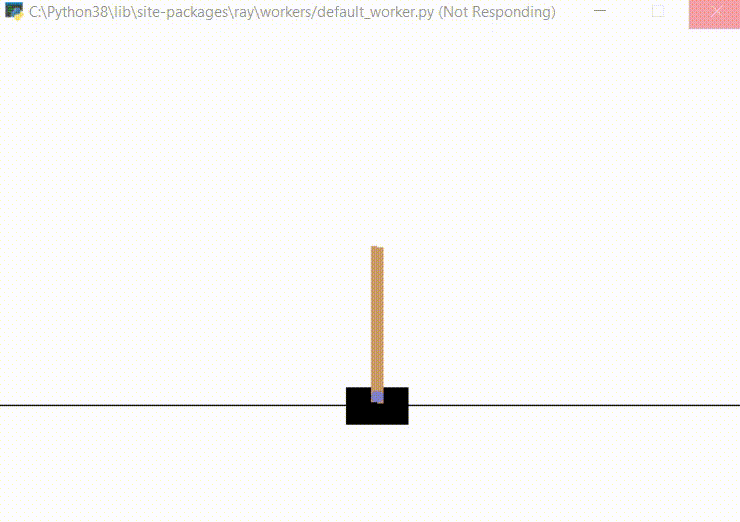

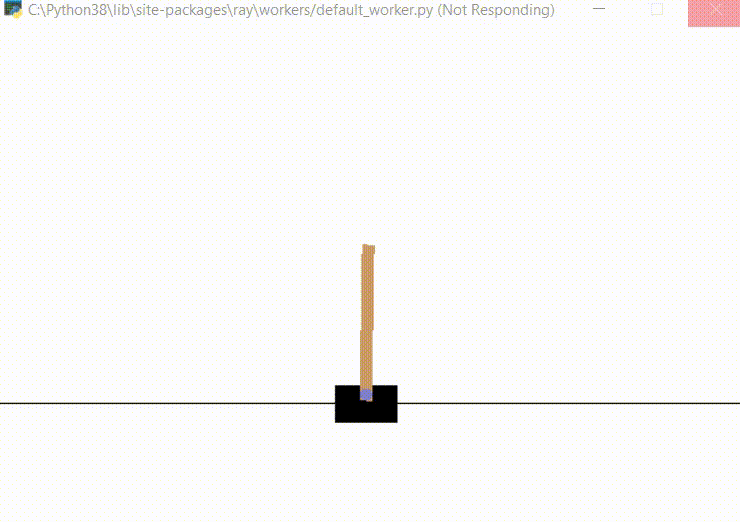

#### Lunarlander

---

The second game we have assessed with MuZero is LunarLander. The previous game was important to test as a baseline, but this one is really important because the environment is similar to the one from an _Atari game_, with the same name. MuZero was the first of its family to really tackle Atari games so it was important for us to test it out. The environment is described as follows: A landing pad is always placed at the center. Coordinates are the first two numbers in state vector. Reward for moving from the top of the screen to landing pad and zero speed is about 100..140 points. If lander moves away from landing pad it loses a reward back. Episode finishes if the lander crashes or comes to rest, receiving additional -100 or +100 points. Each leg ground contact is +10. Firing main engine is -0.3 points each frame. Landing outside landing pad is possible. Fuel is infinite, so an agent can learn to fly and then land on its first attempt. Four discrete actions available: do nothing, fire left orientation engine, fire main engine, fire right orientation engine. The simulation we used was based on an deterministic version of the [OpenAi gym environment](https://gym.openai.com/), LunarLander-v2, which defines "solving the game" as getting average reward of 200 points.

As before, we are first showing the performance of MuZero agent Naïve Agent on the Lunarlander game, and we can witness the random moves that it takes to failing at landing on the launchpad.

Below it, we observe a trained agent, which diverges a bit at the beginning of the game, but is applying a real strategy to deviate from his base trajectory, in order to safely land on the launchpad. It was a big satisfaction to see it land between the yellow flags, as MuZero had no knwoledge on the environment dynamics, and as this game is part of the Atari family, it represents a big leap forward. The agent was also trained with a fully connected network for several hours, but obviously with [different hyperparameters](https://github.com/alexZajac/muzero_experiments/blob/master/muzero/games/lunarlander.py#L33-L112) than the ones of Cartpole.

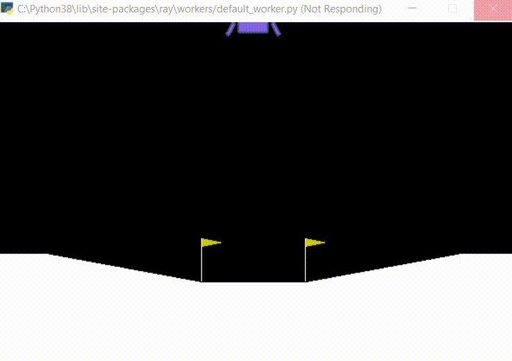

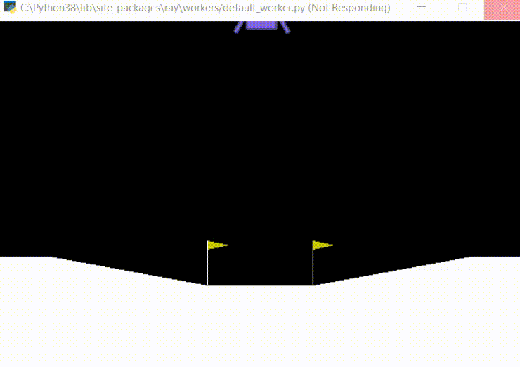

### Board Games ♟️

#### Connect 4

---

No need to introduce connect4. This famous game is also often used as a comparison for deep reinforcement learning algorithms. To remind the rules clearly, connect4 is a two-player connection board game, in which the players choose a color and then take turns dropping colored discs into a seven-column, six-row vertically suspended grid. The pieces fall straight down, occupying the lowest available space within the column. The objective of the game is to be the first to form a horizontal, vertical, or diagonal line of 4 of one's own discs. Connect Four is a solved game, meaning the first player can always win by playing the right moves, and this is a characteristic we will compare upon.

As always, we begin by a standard comparison of MuZero when naïve, and when trained. First, we can clearly see that when not trained, the agent has no clue of what's going on.
Meanwhile, on the right, we loaded the weights from a [pretrained model](https://github.com/alexZajac/muzero_experiments/blob/master/muzero/good_results/connect4-2021-01-18--07-07-21/model.checkpoint), and obtained astonishing performance. Muzero is starting with the circle symbol, and we can clearly see that it picks the optimal move first (center of the board), builds up strategy by controlling the center with diagonals, and keeps on being aggressive, forcing us to always counter his moves until we are no longer in a position to hold on. We do not consider ourselves professionals of the connect4 game, but throughout the games we have played with it, it showed extraordinary performance from just a few hours of training, starting from literally, zero.

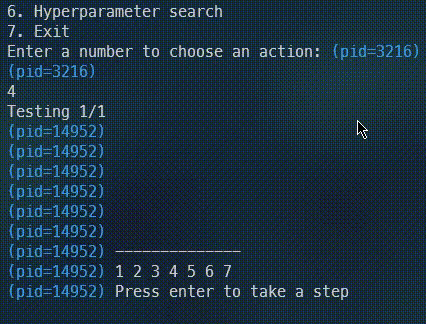

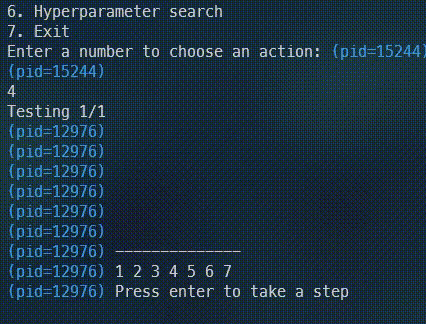

We also had access to the tensorboard results of the training phase. It is interesting to see the rewards on the left, as we witness the MuZero reward going up and converging while the reward of the expert opponent converges to zero. On the right, we can see that 100k iterations are sufficient to bring the reward loss to zero, and it is coherent with the graphs the left, but it seems that we didn't plateau yet for the policy and value losses. The parameters used for training as well as the hardware setup is [available here](https://github.com/alexZajac/muzero_experiments/tree/master/muzero/good_results/connect4-2021-01-18--07-07-21).

We also recorded some self play, when MuZero is playing against another MuZero agent. It was really interesting to witness that the strategies are the same across many games, since they depend on the same underlying model, but the two agents make quite a good job at defending themselves.

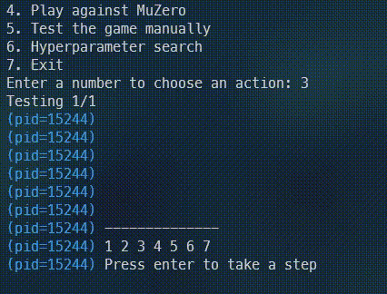

#### Animal Shogi

---

This game was also important with regards to the paper since it's a variant of Shogi. Here to have a trainable and testable environment, we tested the Animal Shogi version. Basically, it is a variant of standard Shogi (resembling to chess), which is played on a 3×4 board, and is also including drops (replace a taken piece on the board), except that pieces can only move one square at a time, and the king reaching the enemy camp as an additional way to win the game. Each player starts the game with four pieces: a Lion (king) in the center of the home row ("forest"), a Giraffe (rook) to the right of the king, an Elephant (bishop) to the left of the king and a Chick (pawn) in front of the king.
If the Chick advances two squares to reach the final rank (the "sky" for the player that started in the forest), it promotes to a Hen, which can move one square any way except diagonally backwards (like the gold general in shogi). The goal is to capture the lion of the opponent, so it assembles many of the interesting dynamics of chess, at a smaller scale.

Once again, we familiarized ourselves with the rules, and destroyed the untrained random MuZero agent with 2 moves. But it was a whole different story with the trained agent. While we had no knowledge about this game before the project, and it was the same case with MuZero, we expected the game to be quite long. It wasn't the case for the bottom video, where we can clearly see MuZero attacking our side, or forcing us to withdraw piece to the back of the board. We couldn't even really try an attack except taking the chick in the beginning of the game. We can clearly see in the GIF that the more the game goes on, the more we hesitate, until we are placed in a checkmate by the two elephants. It is really interesting here that MuZero learned to alternate between playing with the pieces on the board, and with the pieces from the stock, and it is those moves that led him to victory. For the 2 games below, MuZero played with blue.

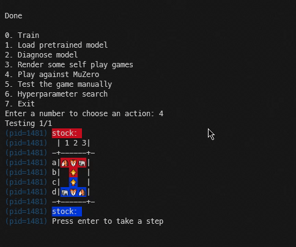

We also had access to the tensorboard results of the training phase for Animal Shogi. The dark red line is the first 100k training steps and the pink line is the next 100k training steps. We can see that the rewards follow a coherant pattern for the first 100k steps, and then stagnate. It is not much different for the losses, except for the value loss, which only decreases after 100k iterations: this means that the value network is harder to train, and the long term planning of stocking/playing pieces might be related to this value evaluation function. The parameters used for training as well as the hardware setup is [available here](https://github.com/alexZajac/muzero_experiments/tree/master/muzero/good_results/animal_shogi-2021-01-24--19-21-10).

We were really stroked by the self play games, where we can see very different strategies for the 2 MuZero agents: the red player is more in a stocking strategy first, sacrificing some pieces in the beginning of the game, to gain advantage in the longer run, and the blue player, which is more aggressive. Once again, seeing this kind of results on a game that contains predefined rules that MuZero tried to model, is amazing, especially with the 2 distinct behaviors (stocking or playing).

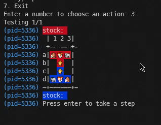

### Comparison to AlphaZero and Minimax with alpha-beta pruning 🐍

We chose the Connect4 game to compare MuZero over a deterministic method and its predecessor, AlphaZero.

#### MuZero & Minimax Planning algorithm

---

In this part, we wanted to compare MuZero with a more standard method adapted for board games: the [Minimax Algorithm with alpha-beta pruning](https://www.hackerearth.com/blog/developers/minimax-algorithm-alpha-beta-pruning/).

In the table you can see the results of various games played between the 2 agents. The MuZero agent is the same as the one we have played with, and the difficulty of the Minimax algorithm is set to maximum, meaning is able to anticipate up to 5 turns of moves.

Here are the 3 games where Minimax started to play first, with the circles:

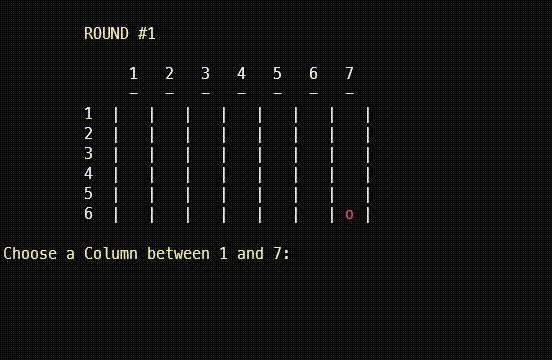

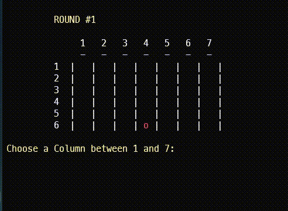

And here are the 3 games where MuZero started to play first, with the circles:

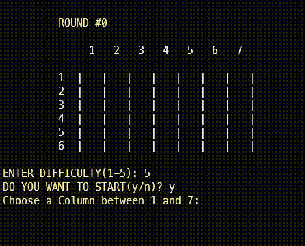

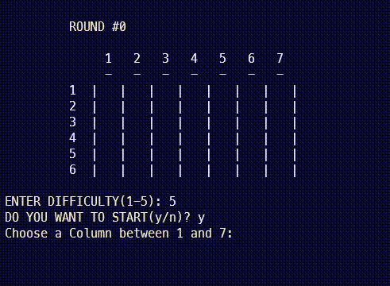

A few observations on the results and behaviors of the agents:

- When MuZero is starting, it is able to completely crush the Minimax algorithm, and this might be due to the fact that connect4 is a solved game for the player that is starting. On the 3 different games, MuZero started with the optimal move and put pressure on Minimax during the whole game.
- We observed that sometimes the advantage is not really on a specific player, and this is especially in these situations that MuZero is better than Minimax : when there is no clear choice of advantage to play a piece in a specific spot, the decisions of Minimax appear to be more random than the ones of MuZero, and this is where MuZero is able to obtain advantage.
- When Minimax is starting, the games are a little bit different, with 1 win for the deterministic algortihm. it proves that the strategy of Muzero is still not perfect, and that a depth of 5 turns for Minimax is large enough to be able to obtain an advantage in specific situations.

#### MuZero & AlphaZero

---

Our goal in this part was to assess the father and the son of no-human/domain knowledge reinforcement learning algorithms provided by Deepmind. The major difference between the 2 agents is that MuZero doesn't have any prior on the game's rules, it has no knowledge of the environment dynamics.

We can see side by side 2 games, respectively when AlphaZero is starting with the circles, and then when MuZero is starting with the circles:

A few observations on the results and behaviors of the agents:

- The outcome is the same in both cases, the AlphaZero Agent wins. This is interesting since the advantaged player is the one starting, and MuZero didn't manage to win even when starting. Nevertheless, both games are pretty tight and it's only with the last pieces that AlphaZero wins.
- One possible explanations to this is that the MuZero algorithm doesn't have any prior on the game rules, so it might take longer to train it in order to achieve the same performance as AlphaZero. Even in the paper we can see that MuZero exceeds AlphaZero for the game of go (the most similar to connect4) after 500k steps, and our algorithm was only trained for 100k of them, and we can see that it learns a lot after this threshold in the paper.
- Another reason might come from the disparities in the 2 code implementations, and with the hyperparameters that both used, here are the [hyperparameters for AlphaZero](https://github.com/alexZajac/muzero_experiments/blob/master/alphazero/config.py). With a more coherent base for the 2 algorithms and more training steps, it is almost sure that MuZero would reproduce the results in the paper, and draw or win against his father, AlphaZero.

We also tried to increase the number of simulations for MuZero to 500, versus 50 for AlphaZero, but the latter still managed to win after a differently-looking game compared to when both agents were allowed 50 simulation steps each. This reinforces the arguments stated above about the training of MuZero.

